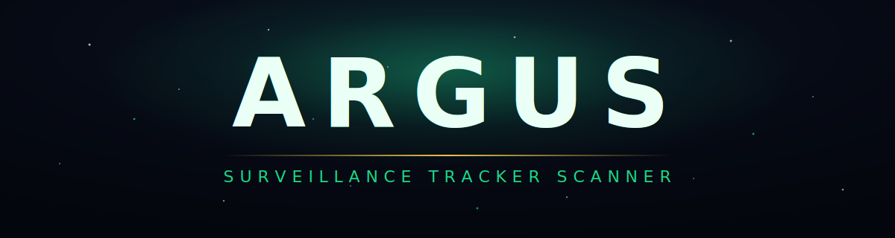

<div align="center">




**Passive BLE/WiFi surveillance detection for the Heltec WiFi LoRa 32 V3.**
Written in Zig + ESP-IDF. Pocket-sized. Zero external parts needed.

</div>


## ✦ What it detects

- **Flock Safety ALPR cameras** — 33 MAC OUI prefixes, SSID format validation
- **Raven gunshot sensors** — 8 BLE service UUIDs, firmware version classification
- **Drone Remote ID** — ASTM F3411 over WiFi and BLE (DJI, Autel, Skydio, Parrot)
- **Amazon Sidewalk** — Ring doorbells, Echo devices, Tile via Sidewalk
- **Consumer surveillance cameras** — Hikvision, Dahua, Reolink, Axis, Bosch, Hanwha
- **Apple AirTag / Find My** — BLE advertisement pattern, payload length verification
- **Tile / Samsung SmartTag** — service UUID and manufacturer ID matching
- **IMSI catcher / Stingray** — carrier probe burst analysis (indirect, see STINGRAY.md)

Alerts via buzzer chirp and LED blink. OLED shows device type, RSSI proximity,
distance estimate, and confidence score. All detections logged to SPIFFS.


## ✦ Why this exists

Flock Safety operates the largest private surveillance network in the US.
Over 5,000 municipalities have sold their streets to automated license plate
readers that photograph every passing car. Raven/ShotSpotter microphones
blanket urban neighborhoods. Ring doorbells create a neighborhood-scale
surveillance mesh. AirTags are abused for stalking.

This device tells you when you're being watched. It costs $15 in parts.
No subscription. No cloud. No phone required.


## ✦ Hardware

| Part | Required? | Cost |
|------|-----------|------|
| Heltec WiFi LoRa 32 V3 (ESP32-S3) | Yes | $15 |
| Piezo buzzer (GPIO 3) | Optional | $1 |
| LiPo battery (JST 1.25mm) | Optional | $8 |
| NEO-6M GPS module | Optional | $5 |

Zero external parts for basic operation — onboard LED blinks on detection.


## ✦ How it works

C modules (ESP-IDF) handle all hardware — NimBLE, WiFi stack, SX1262 LoRa,
SSD1306 I2C, SPIFFS, GPS UART, ADC. Zig modules handle all logic — BLE/WiFi
classification, confidence scoring, OUI matching, OLED display, mesh protocol,
CSV logging, UX.

A thin C entry point (`main/main.c`) initializes ESP-IDF subsystems and
hands control to `zig_main()`. Control never returns to C.

```
src/main.zig      — Entry point, main loop, extern fns, tracker table, WiFi hopping
src/scanner.zig   — BLE/WiFi classifiers, scoring, NMEA, CSV, Stingray
src/display.zig   — SSD1306 driver, 7-page UI, LED alerts, BLE passkey screen
src/mesh.zig      — LoRa mesh packets
src/api.zig       — JSON renderers for the dashboard + BLE stream
main/*.c          — Hardware drivers (ble + GATT, wifi, lora, spiffs, gps, oled)
web/ble.html      — Web Bluetooth phone client (hosted on GitHub Pages)
src/ouis.txt      — surveillance MAC OUI prefixes + vendor/category (compile-time parsed)
```


## ✦ Phone & web interface

- **Base station** — joins your home WiFi and serves a live dashboard
  (Threats / Map / Mesh, Leaflet camera map, CSV export).
- **Mobile unit** — exposes the same live view over **Bluetooth**:
  `web/ble.html` is a Web Bluetooth client (Android / desktop Chrome) that
  pairs with a passkey shown on the OLED and streams status, detections,
  mesh peers, and a GPS map — all while WiFi channel hopping keeps running.


## ✦ Binary size

~360 KB with all detection modules, scoring, OLED driver, and LoRa mesh.
Compares to ~530 KB for BLE + OLED alone in the C++ Arduino equivalent.

Savings from:
- Pure-Zig SSD1306 driver (2KB vs U8g2's 500KB)
- @embedFile + comptime OUI parsing (no runtime filesystem)
- No Arduino framework overhead
- ReleaseSafe optimization (no panic strings, no monomorphization bloat)


## ✦ License

AGPLv3.
You can use it, modify it, and sell devices running it,
as long as you share your changes under the same license.


## ✦ Credits

- **@NitekryDPaul** — WiFi promiscuous detection research, 30-OUI Flock Safety target list, addr1-receiver technique
- **Michael / DeFlockJoplin** — Wildcard-probe-request signature, 31st OUI (82:6b:f2)
- **colonelpanichacks** — Flock-You firmware (C++ reference implementation)
- **zmattmanz** — Flock-Detector 3.0 (confidence scoring, Raven UUIDs, RSSI trend)
- **kassane** — Zig ESP-IDF integration, zig-espressif-bootstrap toolchain
- **recamshak** — esp32-baremetal-zig (SVD-generated register definitions)


## ✦ Related projects

- [Flock-You](https://github.com/colonelpanichacks/flock-you) — C++ Flock Safety detector (Seeed XIAO ESP32-S3)
- [Flock-Detector 3.0](https://github.com/zmattmanz/flock-detection) — C++ multi-method confidence scoring
- [DeFlock](https://deflock.me) — Crowdsourced ALPR location data
- [zig-esp-idf-sample](https://github.com/kassane/zig-esp-idf-sample) — Zig + ESP-IDF reference
- [esp32-baremetal-zig](https://github.com/kassane/esp32-baremetal-zig) — Pure Zig ESP32 HAL
